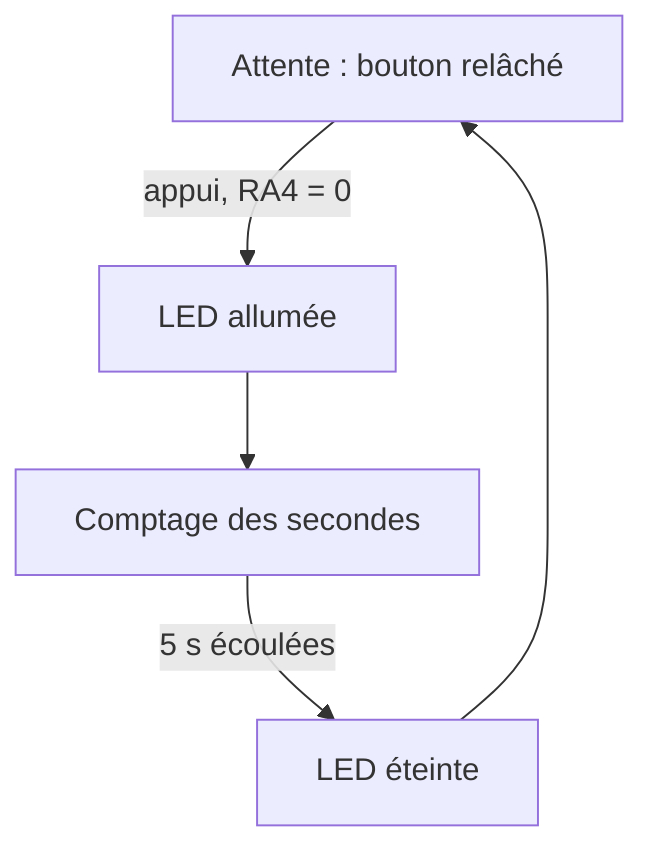
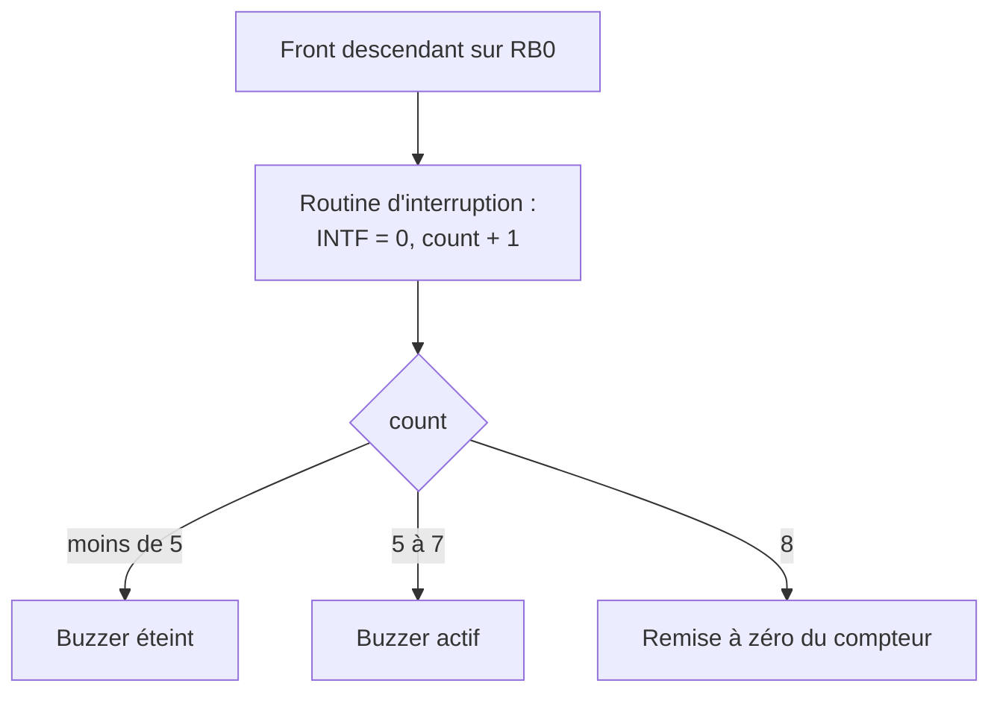

# TP microcontrôleur PIC16F877A en C

Trois programmes de travaux pratiques sur carte PICDEM 2 Plus : un chenillard à quatre LED, une minuterie commandée par bouton poussoir et un buzzer déclenché par interruption externe. Les temporisations sont faites par boucles logicielles, sans timer matériel.

## Présentation

- **Cadre** : travaux pratiques de microcontrôleur, première année du cycle ingénieur Instrumentation, Sup Galilée (Université Sorbonne Paris Nord).
- **Suite** : ces TP préparent le projet [GPS_Microcontroller](https://github.com/tedjelmoulksn-dotcom/GPS_Microcontroller), réalisé sur la même carte.
- **État** : terminés, non maintenus.

## Matériel et outils

| Élément | Détail |
|---|---|
| Carte | Microchip PICDEM 2 Plus Demo Board |
| Microcontrôleur | PIC16F877A |
| Compilateur | HI-TECH PICC sous MPLAB |
| Débogage | Simulateur MPLAB puis ICD 3 |
| Configuration | `__CONFIG(HS & WDTDIS & BOREN & LVPDIS)` |

## Programmes

| Fichier | Fonction | Entrées / sorties |
|---|---|---|
| [`src/chenillard.c`](src/chenillard.c) | Allume successivement les LED D2 à D5 | RB0 à RB3 en sortie |
| [`src/minuterie.c`](src/minuterie.c) | Allume la LED D2 sur appui du bouton, puis l'éteint après 5 s au plus | RA4 en entrée (bouton), RB0 en sortie (LED) |
| [`src/buzzer_interruption.c`](src/buzzer_interruption.c) | Compte les appuis par interruption et fait sonner le buzzer à partir du cinquième | RB0 en entrée d'interruption, RC2 en sortie (buzzer) |

### Chenillard

- `led(led, action)` allume ou éteint une LED désignée par une constante symbolique (`D2` à `D5`, `on` / `off`).
- `delay_ms(ms)` répète une boucle calibrée d'environ 1 ms ; chaque LED reste allumée 187 ms.

### Minuterie

- `tempo1ms()` : boucle vide de 0x34 itérations, calibrée pour environ 1 ms.
- `delay_1s()` : 935 appels de `tempo1ms()`, valeur ajustée au simulateur pour obtenir 1 s.

### Buzzer sur interruption

- Configuration : `INTEDG = 0` (front descendant), `INTE = 1`, `GIE = 1`, drapeau `INTF` remis à zéro dans la routine.
- `BUZER_on()` génère un signal carré sur RC2 : 200 périodes de 2 ms, soit environ 500 Hz.
- La variable `count` est globale pour être partagée entre la routine d'interruption et le programme principal.

## Notions abordées dans le compte rendu

- Calibration d'une temporisation logicielle et vérification par points d'arrêt.
- Lecture d'un bouton poussoir et niveaux de tension sur RA4 et RB0.
- Interruptions matérielles et plage de fréquences audibles pour le buzzer.

Le compte rendu est dans [`docs/`](docs).

## Limites

- **Chenillard** : `init_port()` configure RB2 à RB5 en sortie alors que les LED sont sur RB0 à RB3, et la dernière comparaison de `led()` utilise `=` au lieu de `==`. Le fichier est publié tel qu'il a été retrouvé.
- **Buzzer** : la routine est déclarée `void interrupt_traitement_it(void)` ; avec HI-TECH PICC, le mot-clé `interrupt` doit être séparé du nom (`void interrupt traitement_it(void)`) pour qu'elle soit réellement appelée sur interruption. Le fichier est publié tel qu'il a été retrouvé.
- **Temporisations** : dépendantes du compilateur et de l'oscillateur (4 MHz) ; elles ne sont pas précises.
- **Compilation** : non rejouée ; les en-têtes `pic.h` et `pic168xa.h` viennent du compilateur HI-TECH PICC.

## Licence

Aucune licence n'a été définie pour ce code.
