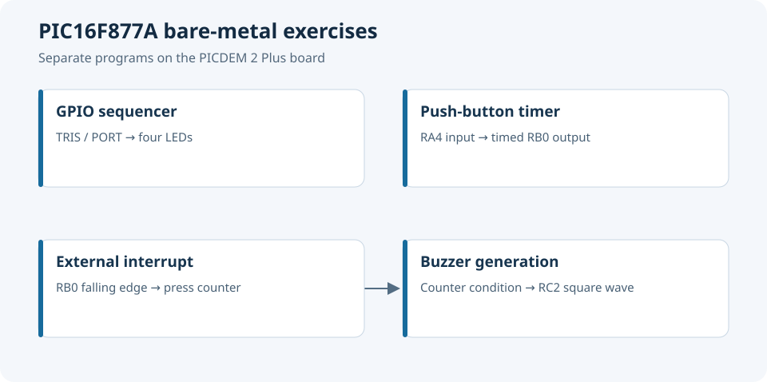

# PIC Microcontroller Laboratories

PIC16F877A coursework on GPIO, software timing, push buttons, interrupts, displays and EEPROM. The main examples implement an LED sequence, a timed LED and a buzzer triggered by external interrupts.

*Independent PIC laboratory examples; each program uses its own hardware configuration.*

## Repository guide

| Location | Contents |
|---|---|
| [src/](src/) | Organised C and assembly examples |
| [docs/](docs/) | Lab reports and course references |
| [assets/](assets/) | MPLAB and hardware captures |
| [archive/](archive/) | Original MPLAB projects and source variants |

## Getting started

Use MPLAB with the original PIC16F877A configuration and HI-TECH PIC C compiler for the C exercises. Assembly projects include their own device files and linker settings.

## Project context

Experiments use the PICDEM 2 Plus board. The related [GPS receiver](https://github.com/tedjelmoulksn-dotcom/GPS_Microcontroller) is maintained as a separate project.
